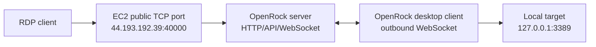

# OpenRock

OpenRock is a basic self-hosted TCP tunnel for cases like Remote Desktop over a public relay. It gives you the same operating model as:

```bash
ngrok tcp 3389
```

but with your own server and your own port range.

## Architecture



The desktop client always dials out to the server. The target machine does not need an inbound firewall rule or public IP. Incoming TCP clients connect to a server port, and the server multiplexes each TCP connection over the client WebSocket.

## What is included

- `packages/server`: Express admin API, React dashboard hosting, WebSocket agent gateway, and public TCP listeners.
- `packages/agent`: reusable tunnel engine plus a CLI kept for development and smoke tests.
- `packages/desktop`: Electron desktop client that runs the tunnel engine, reconnects automatically, and shows client status.
- `packages/web`: React dashboard for connected clients, RDP endpoints, client metadata, counters, and disconnect control.
- `deploy/*`: Amazon Linux 2023 server env/systemd templates and a desktop client config example.
- `tests/smoke-tcp-tunnel.mjs`: local end-to-end tunnel and metadata test.

## Local development

Requirements:

- Node.js 20.11 or newer.
- npm 10 or newer.

Install and build:

```bash
npm install
npm run build
```

Run the end-to-end smoke test:

```bash
npm run smoke
```

Run locally:

```bash
export OPENROCK_PUBLIC_HOST=127.0.0.1
export OPENROCK_HTTP_HOST=127.0.0.1
export OPENROCK_HTTP_PORT=8080
export OPENROCK_TCP_BIND_HOST=127.0.0.1
export OPENROCK_TCP_PORT_RANGE=40000-40100
export OPENROCK_AGENT_TOKEN="$(openssl rand -hex 32)"
export OPENROCK_ADMIN_TOKEN="$(openssl rand -hex 32)"
npm run build
npm run start -w @openrock/server
```

In another terminal, start the desktop client:

```bash
OPENROCK_AGENT_TOKEN="<same-agent-token>" npm run dev:desktop
```

The desktop client defaults to:

- Server URL: `ws://44.193.192.39:8080/agent`
- Local target: `127.0.0.1:3389`
- Start at login: enabled

For local development, change the server URL in the app to `ws://127.0.0.1:8080/agent`.

The legacy CLI still exists for smoke tests and server-side debugging:

```bash
OPENROCK_AGENT_TOKEN="<same-agent-token>" \
node packages/agent/dist/index.js \
  --server-url ws://127.0.0.1:8080/agent \
  --agent-id local-rdp \
  --target-host 127.0.0.1 \
  --target-port 3389
```

Then connect your RDP client to the public endpoint shown by the desktop client or dashboard, for example `127.0.0.1:40000` locally or `44.193.192.39:40000` on EC2.

## Desktop client

Run from source:

```bash
npm run dev:desktop
```

Build an installable app:

```bash
npm run package:desktop
```

The app stores its local config in Electron's user data directory as `config.json`. It stores the agent token needed to connect to the server, but it does not store or display any RDP password. Remote Desktop credentials remain between the RDP client and the target machine.

The desktop client reports these fields to the server dashboard:

- client ID
- display name
- hostname
- current OS username
- local IP addresses
- platform/release/architecture
- local target host and port
- assigned public TCP endpoint

## EC2 deployment for `44.193.192.39`

The provided host is Amazon Linux 2023 and already has:

- Node: `/home/ec2-user/.local/bin/node`
- npm: `/home/ec2-user/.local/bin/npm`
- Existing localhost service on port `3000`, so OpenRock defaults to `8080`.

Deploy from this workspace:

```bash
chmod +x scripts/deploy-ec2.sh
OPENROCK_SSH_KEY=/path/to/hermes-agent-server.pem ./scripts/deploy-ec2.sh
```

On the EC2 server:

```bash
sudo cp /opt/openrock/deploy/ec2-openrock.env.example /opt/openrock/.env
sudo sed -i "s/replace-with-strong-agent-token/$(openssl rand -hex 32)/" /opt/openrock/.env
sudo sed -i "s/replace-with-strong-admin-token/$(openssl rand -hex 32)/" /opt/openrock/.env
sudo cp /opt/openrock/deploy/openrock-server.service /etc/systemd/system/openrock-server.service
sudo systemctl daemon-reload
sudo systemctl enable --now openrock-server
sudo systemctl status openrock-server --no-pager
```

Dashboard:

```text
http://44.193.192.39:8080
```

Use `OPENROCK_ADMIN_TOKEN` from `/opt/openrock/.env` to sign in.

## AWS security group

The EC2 security group must allow:

- TCP `8080` from your admin IP for the dashboard and client WebSocket.
- TCP `40000-40100` from the IPs that will connect with Remote Desktop.
- TCP `22` from your admin IP for SSH.

For a production RDP setup, do not open `40000-40100` to the whole internet unless you accept the risk. Prefer a known source IP, VPN source range, or a short-lived rule.

## Running the desktop client for RDP

On the machine that can reach Remote Desktop locally:

```bash
npm install
npm run build
npm run dev:desktop
```

In the app, set:

- Server URL: `ws://44.193.192.39:8080/agent`
- Agent token: value of `OPENROCK_AGENT_TOKEN` from `/opt/openrock/.env`
- Target host: `127.0.0.1`
- Target port: `3389`
- Public port: optional, for example `40000`

After it connects, use the dashboard's `TCP connection URL` value in Microsoft Remote Desktop.

## Troubleshooting logs

Server logs:

```bash
ssh -i /path/to/hermes-agent-server.pem ec2-user@44.193.192.39 \
  "sudo journalctl -u openrock-server --since '30 minutes ago' --no-pager -o short-iso"
```

Windows desktop client logs:

```text
%APPDATA%\OpenRock Client\openrock-client.log
```

The server logs each tunnel connect/disconnect, stream open/close/error, byte counts in both directions, and heartbeat timeouts.

## Important limitations

- This is a basic TCP tunnel, not a full ngrok replacement.
- It does not terminate TLS for TCP tunnels; RDP encryption remains the responsibility of RDP.
- It does not yet implement per-client ACLs, user accounts, audit logs, rate limits, or binary WebSocket framing.
- Keep both tokens secret. The admin token controls the dashboard. The agent token allows new tunnels.
